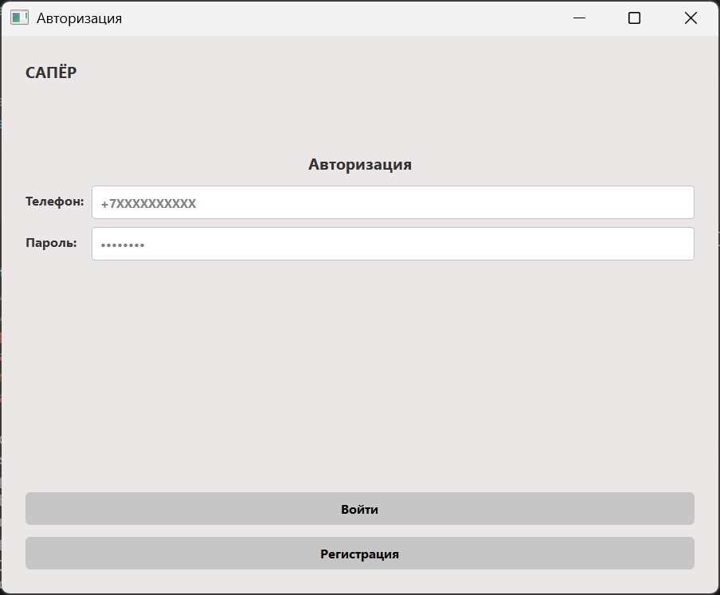
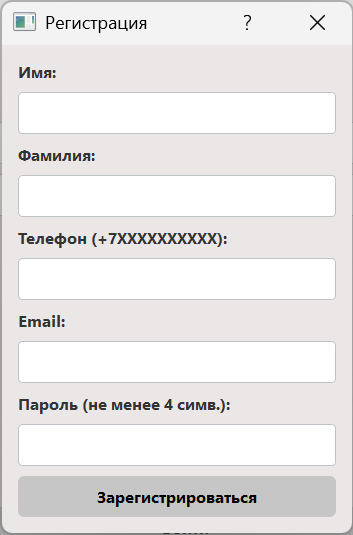
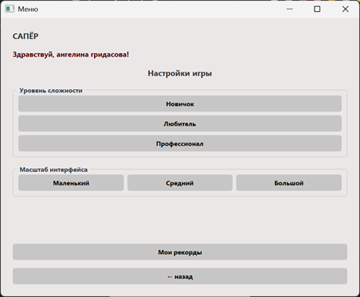
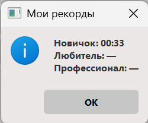
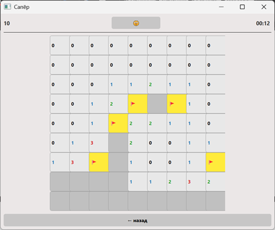

## Лабораторная работа № 3 «Приложения с графическим интерфейсом»
## Игра «Сапёр» 


Проект реализован на **Python с использованием библиотеки PyQt5**, поддерживает регистрацию/авторизацию, выбор уровня сложности, масштабирование экрана и сохранение рекордов.

---

##  Требования

Для запуска приложения необходимы:

- **Python 3.7 или выше**
- Библиотека **PyQt5**

---

##  Установка и запуск

1. **Клонируйте репозиторий** (или скопируйте файлы в папку):
   ```git clone https://github.com/huisidun/applied_programming.git ```
2. **Перейдите в папку с игрой:**
   ```cd lab3```
3. **Установите зависимости:**
   ```pip install -r requirements.txt```
4. **Запустите игру:**
   ```python main.py```

### Окно авторизации
сначала вы попадете именно сюда, но для дальнейшей игра пройдите регистрацию


### Окно регистрации


### Меню игры
вот вы попали в меню самой игры

тут можно настроить масштаб экрана, выбрать уровень сложности и посмотреть имеющиеся рекорды:


### Игровое поле
удачи!


---

### Примечание
для входа можно использовать тестовые данные 
Телефон: +70000000000
Пароль: qwerty